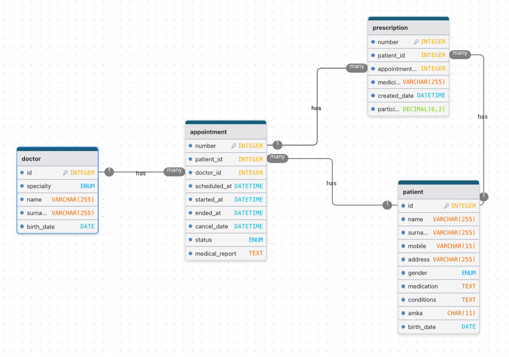

# Design Document

## Scope

### Purpose

The purpose of this database is to manage the core operations of a small medical center. It is designed to store and organize information about doctors, patients, medical appointments, and prescriptions and ensures data integrity through relational constraints.

The database supports tracking patient visits, assigning doctors to appointments, recording medical reports, and issuing prescriptions linked to specific appointments.

### In Scope

The database includes the following strong weak entities:

- Doctors, their information and their medical specialties
- Patients and their personal and medical information
- Appointments between patients and doctors and their relevant information
- Prescriptions issued during appointments

### Out of Scope

The following concepts are intentionally excluded from the scope of this database:

- Departments, rooms or equipment
- Billing systems (beyond basic prescription participation fees)
- Insurance providers
- User authentication or role-based access control
- Detailed medical history versioning or audit logs

## Functional Requirements

### Supported Functionality

A user of the database should be able to:

- Register doctors with a defined medical specialty
- Register patients with identifying and medical information
- Schedule appointments for patients with specific doctors
- Track appointment status automatically based on timestamps
- Record medical reports for completed appointments
- Issue prescriptions linked to a specific appointment and patient
- Retrieve appointment history per patient
- View appointments together with assigned doctor information

### Unsupported Functionality

The database does not support:

- Managing staff other than doctors
- Automated billing, invoicing, or payments
- Real-time scheduling conflict resolution
- Editing historical medical records once finalized
- Advanced analytics or reporting beyond basic queries and views

## Representation

### Entities

The database represents the entities described below along with their respective data types:

#### Doctor

- **id** (INT, primary key)
- **specialty** (ENUM)
- **name** (VARCHAR)
- **surname** (VARCHAR)
- **birth_date** (DATE, nullable)

Doctors are assigned a specialty using an ENUM to restrict values to known medical fields and prevent invalid data entry.

#### Patient

- **id** (INT, primary key)
- **name** (VARCHAR)
- **surname** (VARCHAR)
- **mobile** (VARCHAR)
- **address** (VARCHAR)
- **gender** (ENUM)
- **medication** (TEXT)
- **conditions** (TEXT)
- **amka** (CHAR, unique)
- **birth_date** (DATE)

The AMKA field represents a number unique to each citizen which is therefore enforced as unique to ensure each patient is uniquely identifiable.
TEXT fields are used for medication and conditions to allow flexible medical descriptions.

#### Appointment

- **number** (INT, primary key)
- **patient_id** (foreign key)
- **doctor_id** (foreign key, nullable)
- **scheduled_at** (DATETIME)
- **started_at** (DATETIME, nullable)
- **ended_at** (DATETIME, nullable)
- **cancel_date** (DATETIME, nullable)
- **status** (ENUM)
- **medical_report** (TEXT, nullable)

Appointment status is derived automatically using triggers, ensuring consistent lifecycle management without manual intervention.

#### Prescription

- **number** (INT, primary key)
- **patient_id** (foreign key)
- **appointment_number** (foreign key)
- **medicine** (VARCHAR)
- **created_date** (DATETIME)
- **participation_fee** (DECIMAL)

Prescriptions are strictly linked to both a patient and a specific appointment, ensuring that prescriptions cannot exist independently of a medical visit.

### Relationships

- A **patient** can have many **appointments**
- A **doctor** can be assigned to many **appointments**
- An **appointment** belongs to exactly one **patient**
- A **prescription** belongs to exactly one **appointment** and one **patient**
- An **appointment** may exist without an assigned doctor (e.g., before confirmation)

An entity relationship diagram illustrating these relationships is shown below and is included with this submission:

## Optimizations

The following optimizations were implemented:

- Indexes on foreign keys (`patient_id`, `doctor_id`) to speed up joins
- Indexes on frequently searched fields such as patient surname and appointment date
- A database view (`patient_appointments`) combining patients, appointments, and doctors for simplified querying
- ENUM types to reduce storage overhead and prevent invalid categorical data
- Triggers to automatically manage appointment status based on timestamps

These optimizations improve query performance, data consistency, and usability.

## Limitations

- The database does not enforce chronological constraints between appointment timestamps (e.g., started_at before ended_at)
- Medical data is stored as free text, limiting structured querying
- The system assumes a single prescription per entry and does not model dosage schedules
- No support exists for historical versioning of medical records
- The design is suitable for small to medium-scale systems but may require refactoring for large hospitals

Despite its limitations, the database provides a consistent foundation for managing the core operations of a small medical center. In the future, more functionality may be added so that the database can keep track of cancelled appointments in a separate table or implement soft deletes for any entry.
